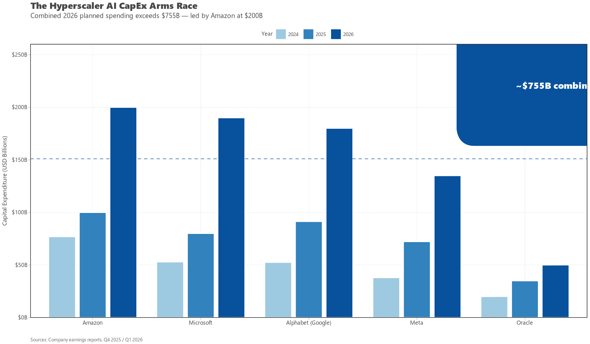
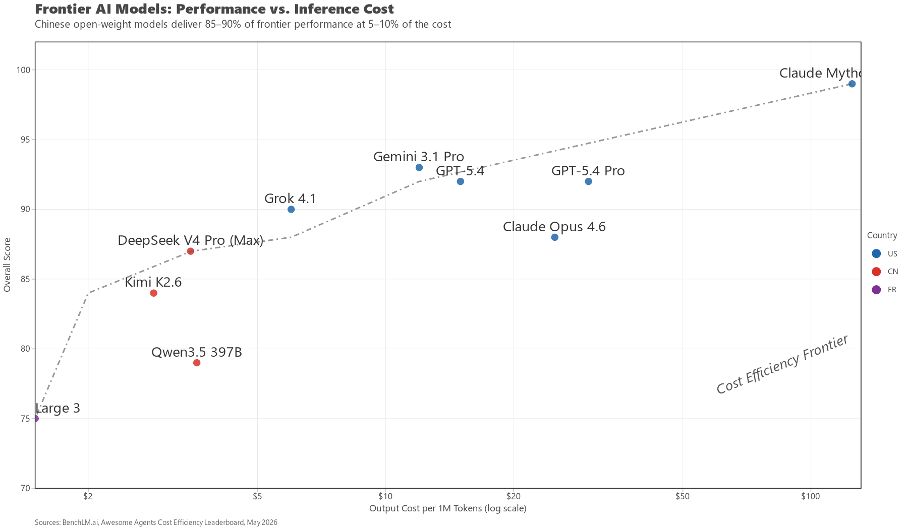
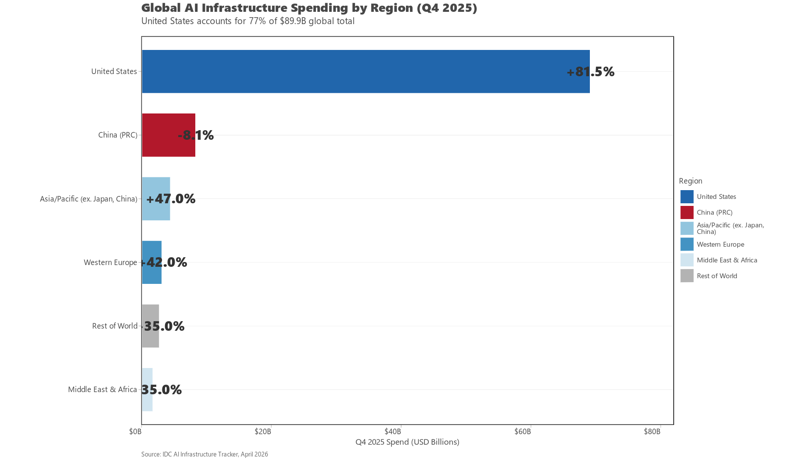
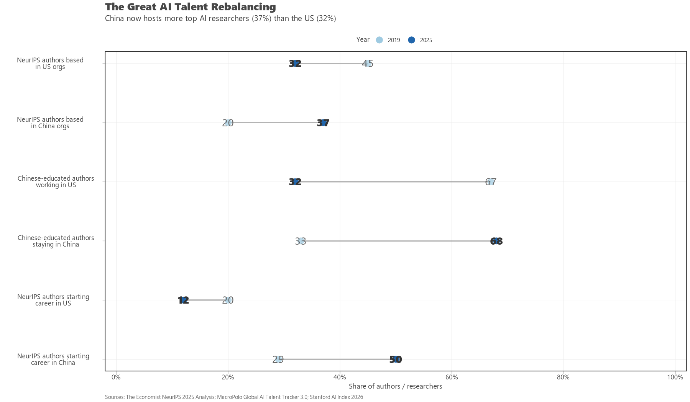
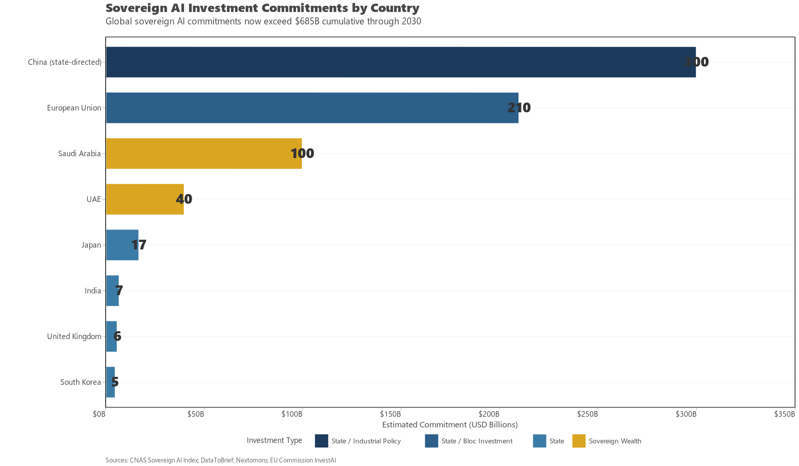
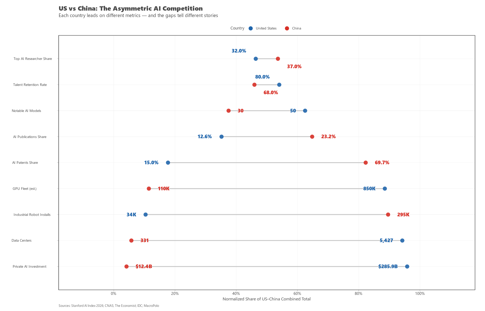

# The $700 Billion Question: Who Really Wins the AI Race?

## A Data-Driven Forecast of the Struggle for Supremacy Among Nations, Companies, and the Hybrids Caught Between Them

---

On a Thursday afternoon in late January 2026, Mark Zuckerberg posted a photograph on Facebook that was not, in any honest sense, a photograph at all. It was a rendering: a grey, windowless slab in a Louisiana field, so vast that the company — with the helpfulness peculiar to those who have lost all sense of proportion — superimposed a silhouette of Manhattan over it for scale. The structure is designed to consume more than two gigawatts of electricity, enough to power roughly 1.5 million American homes. Zuckerberg had called 2025 "a defining year for AI." Then Meta initially guided $115-135 billion in capital expenditures for January 2026, later raising its outlook to approximately $145 billion by April — nearly twice what it spent the year before, and more than it spent in 2025 and 2024 combined. [Meta 2026 Capex, Yahoo Finance, April 29, 2026](https://finance.yahoo.com/markets/stocks/articles/meta-just-bumped-2026-capex-232250811.html)

The following week, Sundar Pichai told Alphabet's investors that the company would drop up to $185 billion on AI infrastructure in 2026, more than double the $91.4 billion it spent in 2025. "The risk of under-investing in AI infrastructure," he said, "is far greater than the risk of over-investing." [Alphabet Capex 2026, CNBC, Feb 4, 2026](https://www.cnbc.com/2026/02/04/alphabet-googl-q4-2025-earnings.html) Days later, Andy Jassy at Amazon went further still: $200 billion in capex for 2026, nearly all of it for AWS data centers. [Amazon $200B Capex, CNBC, Feb 6, 2026](https://www.cnbc.com/2026/02/05/why-amazons-ceo-is-confident-with-200-billion-spending-plan.html) Satya Nadella, when his turn came, guided to $190 billion in calendar 2026 capital spending for Microsoft — $25 billion of it attributable solely to the rising price of memory chips. [Microsoft $190B Capex, The Register, April 30, 2026](https://www.theregister.com/off-prem/2026/04/30/microsoft-lifts-2026-capex-by-25b-to-cover-price-rises/)

Combine the four largest hyperscalers, and the figure becomes almost impossible to grasp: roughly $700 billion in a single year, flowing into servers, concrete, networking gear, and the electrical substations required to keep it all running. Oracle adds another approximately $50 billion on top of that. [Hyperscaler CapEx $690B 2026, Introl Blog, Feb 20, 2026](https://introl.com/blog/hyperscaler-capex-690-billion-microsoft-azure-power-bottleneck-2026) That sum — the aggregate planned capital expenditure of four American technology companies in one calendar year — exceeds the entire GDP of Sweden, or Poland, or Belgium. This is what the private sector believes it must spend simply to avoid losing the artificial intelligence race.

But there is a data point that keeps surfacing, like a fault line running beneath the headline numbers: the performance gap between the best American and Chinese AI models has collapsed to 2.7% — down from a spread of 17.5 to 31.6 percentage points in May 2023. And the United States spent 23 times more on private AI investment to achieve that lead. [Stanford AI Index 2026, The Next Web, April 19, 2026](https://thenextweb.com/news/stanford-ai-index-2026-china-us-performance-gap)

That is the contradiction at the heart of everything. The spending is oceanic. The returns are narrowing. And the question no one can quite answer is whether $700 billion a year purchases a durable advantage — or merely a very expensive head start.

---

## I. The Money: A $700 Billion Year and the Debt Behind It

The scale demands a pause — for comprehension, if not for belief.

| Company | 2026 CapEx Guidance | 2025 CapEx | Year-over-Year Change |
|---|---|---|---|
| Amazon | ~$200B | ~$100B | ~100% |
| Alphabet (Google) | $175–185B | $91.4B | ~100% |
| Microsoft | ~$190B | ~$80B | ~137% |
| Meta | $125–145B | $72.2B | ~87% |
| Oracle | ~$50B | ~$35B | ~43% |
| **Total (4 largest)** | **~$700B** | **~$443B** | **~58%** |

*Sources: [Amazon $200B, CNBC](https://www.cnbc.com/2026/02/05/why-amazons-ceo-is-confident-with-200-billion-spending-plan.html); [Alphabet $175-185B, CNBC](https://www.cnbc.com/2026/02/04/alphabet-googl-q4-2025-earnings.html); [Microsoft ~$190B, The Register](https://www.theregister.com/off-prem/2026/04/30/microsoft-lifts-2026-capex-by-25b-to-cover-price-rises/); [Meta $125-145B, Yahoo Finance](https://finance.yahoo.com/markets/stocks/articles/meta-just-bumped-2026-capex-232250811.html); [Combined, Introl](https://introl.com/blog/hyperscaler-capex-690-billion-microsoft-azure-power-bottleneck-2026)*

The $700 billion figure represents roughly half of total global IT spending directed by four companies into a single sub-sector — AI infrastructure. IDC projects that worldwide AI infrastructure spending will exceed $1 trillion annually by 2029. [IDC AI Infrastructure, April 16, 2026](https://www.idc.com/resource-center/blog/ai-infrastructure-spending-caps-historic-year-at-90-billion-in-q4-2025-2029-spending-to-eclipse-1-trillion/)

The most important structural detail about this money is not its size. It is how it is being raised. For thirty years, big technology companies operated on a simple financial model: high margins, light capital requirements, fortress balance sheets. That model is being shattered by the AI build-out. AI-related tech companies issued $141 billion in corporate debt in 2025, surpassing the previous full-year record, according to Goldman Sachs data, reported by Primary Ignition. Major tech firms now hold roughly $1.35 trillion in total interest-bearing debt — about four times what they held a decade ago. [Goldman Sachs, reported by Primary Ignition, May 8, 2026](https://primaryignition.com/2026/05/08/why-microsofts-80-billion-ai-capital-expenditure-plan-is-the-most-important-corporate-finance-decision-of-the-decade/)

The five hyperscalers are now spending nearly 100% of their operating cash flow on capital expenditures, compared to a 10-year historical average of 40%. Meta structured its $27 billion Hyperion data center as an off-balance-sheet joint venture with Blue Owl Capital. Oracle is expected to nearly triple its net adjusted debt by 2028. Microsoft, the most conservative of the group, still recorded a fiscal third-quarter capex of $31.9 billion — a single quarter whose spending exceeds the annual economic output of many nations. [Introl, Hyperscaler CapEx 2026](https://introl.com/blog/hyperscaler-capex-690-billion-microsoft-azure-power-bottleneck-2026)

The bet, in aggregate, is that the AI market will prove large enough that building infrastructure ahead of demand — a full decade ahead — will look prudent in the rearview mirror. If it does not, the hangover will be measured in trillions.

---

## II. The Frontier Labs: Where Private Capital Goes to Concentrate

Alongside hyperscale infrastructure spending runs a parallel torrent flowing into frontier AI labs — the companies that actually build the models. The numbers here are equally without precedent.

| Company | Latest Round | Post-Money Valuation | Total Raised |
|---|---|---|---|
| OpenAI | $122B (March 2026) | $852B | ~$200B+ |
| Anthropic | $30B (Feb 2026) | $380B | ~$64B |
| xAI | $20B (Jan 2026) | $230B | ~$37B |

*Sources: [OpenAI $122B](https://openai.com/index/accelerating-the-next-phase-ai/); [Anthropic $30B](https://www.anthropic.com/news/anthropic-raises-30-billion-series-g-funding-380-billion-post-money-valuation); [xAI $20B](https://x.ai/news/series-e)*

In total, Q1 2026 saw $255.5 billion in AI venture capital deployed worldwide — more than the full-year 2025 global AI VC total of approximately $130 billion (Crunchbase) — with roughly 83% of all global VC going to AI companies. [Q1 2026 AI VC, AIFOD](https://af.net/realtime/q1-2026-ai-vc-trends-record-255-5-billion-invested/) OpenAI alone raised $122 billion in a single closing in March 2026. The company now reports $2 billion per month in revenue, growing at a rate its executives claim is four times faster than Alphabet or Meta at comparable stages. [OpenAI Scaling Announcement](https://openai.com/index/scaling-ai-for-everyone/)

The strategic architecture of these investments matters more than the sums. Amazon invested $50 billion in OpenAI's round, alongside Nvidia ($30B) and SoftBank ($30B); it also committed an estimated $100 billion in compute resources to Anthropic through its Rainier project. [Amazon $50B to OpenAI, CNBC, Feb 27, 2026](https://www.cnbc.com/2026/02/27/open-ai-funding-round-amazon.html); [Amazon Rainier, The Consulting Network, May 1, 2026](https://www.theaiconsultingnetwork.com/blog/amazon-q1-2026-aws-44b-capex-cre-data-center-investors) The result is a paradox that would be amusing if it were not so expensive: Amazon is simultaneously the largest cloud competitor to OpenAI (via AWS) and the largest financial backer of OpenAI (via its $50B investment). The hyperscalers are hedging — funding the frontier labs while building their own models — because nobody knows which strategy wins, and they cannot afford to bet on the wrong one.

---

## III. The Models: A Tightening Cluster

The output of all this spending — the reason any of it exists — can be measured on a handful of benchmarks. In early 2026, the competitive landscape of frontier models looks like this:

| Rank | Model | Creator | Overall Score* | Reasoning | Coding | Price (per 1M tokens in/out) |
|---|---|---|---|---|---|---|
| 1 | Claude Mythos Preview | Anthropic | 99 | 100 | 100 | $25/$125 |
| 2 | Gemini 3.1 Pro | Google | 93 | 96 | 94 | $2/$12 |
| 3 | GPT-5.4 | OpenAI | 92 | 93 | 89 | $2.50/$15 |
| 4 | GPT-5.4 Pro | OpenAI | 92 | 99.3 | 88 | $10/$30 |
| 5 | Grok 4.1 | xAI | 90 | 91.9 | 79 | $2/$6 |
| 6 | Claude Opus 4.6 | Anthropic | 88 | 92 | 87 | $5/$25 |
| 7 | DeepSeek V4 Pro (Max) | DeepSeek (CN) | 87 | — | 91 | $1.74/$3.48 |
| 8 | Kimi K2.6 | Moonshot AI (CN) | 84 | — | 87 | $0.95/$2.85 |
| 9 | Qwen3.5 397B | Alibaba (CN) | 79 | — | 86 | $0.60/$3.60 |

\* *The "Overall Score" column is a composite drawn from BenchLM.ai's unified leaderboard scoring system (0–100 scale), not from any single benchmark.*

*Note: Claude Mythos Preview benchmarks are self-reported by Anthropic; the model is currently restricted to Project Glasswing partners and is not publicly available. DeepSeek V4 was released in late April 2026 with independently verified benchmarks.*

*Sources: [BenchLM.ai, March 2026](https://benchlm.ai/blog/posts/state-of-llm-benchmarks-2026); [Awesome Agents, April 2026](https://awesomeagents.ai/leaderboards/overall-llm-rankings-apr-2026/); [Cost Efficiency Leaderboard, May 2026](https://awesomeagents.ai/leaderboards/cost-efficiency-leaderboard/)*

Two things stand out. First, the proprietary frontier is no longer a single-player game. Claude Mythos Preview leads the overall table, but Gemini 3.1 Pro leads on reasoning (94.3% on GPQA Diamond) at one-tenth the price of Opus. GPT-5.4 Pro leads on mathematical reasoning. Grok 4.1 offers the fastest inference speeds. The cluster at the top has tightened to the point where use-case, not raw capability, decides the winner. [Attainment Labs, Feb 2026](https://www.attainmentlabs.com/frontier-ai-report-feb-2026)

Second — and more consequential for the geopolitical picture — open-weight Chinese models have entered the serious comparison set. DeepSeek V4 Pro (Max) benchmarks at 87 overall, within striking distance of the top proprietary Western models, at roughly one-tenth the inference cost. Kimi K2.6 from Moonshot AI scores 84 overall and ranks high on BenchLM's overall leaderboard, sitting above many Western proprietary models. [BenchLM.ai](https://benchlm.ai/homepage-v-b)

The Stanford AI Index 2026 frames this numerically: the performance gap between the best US and Chinese AI models has fallen from roughly 20 percentage points in mid-2023 to 2.7% today. This collapse in the gap occurred while the US spent 23 times more on private AI investment than China. [Stanford AI Index 2026, The Next Web](https://thenextweb.com/news/stanford-ai-index-2026-china-us-performance-gap) The spending advantage is enormous. The performance advantage, it seems, is not.

---

## IV. The Compute Asymmetry

If model performance is tightening, compute remains stubbornly, starkly asymmetric.

| Metric | United States | China | European Union |
|---|---|---|---|
| H100-equivalent GPUs (2025 est.) | ~850,000 | ~110,000 | ~50,000 |
| Top500 supercomputer exaflops (public) | ~6.5 | ~0.28 | ~1.2 |
| Data centers | 5,427 | 331 | ~1,500 |
| AI infrastructure spend (Q4 2025) | $69.2B | $8.4B | ~$2.2B |

*Sources: [CNAS Sovereign AI Index](https://interactives.cnas.org/reports/sovereign-ai-index/); [Sanchez GeoCoded, 2025](https://www.sanchez.vc/geocoded-publications/00l845z1utd55wu0uvzedre1rf923c); [IDC AI Infrastructure Q4 2025](https://www.idc.com/resource-center/blog/ai-infrastructure-spending-caps-historic-year-at-90-billion-in-q4-2025-2029-spending-to-eclipse-1-trillion/)*

The United States alone accounted for 77% of global AI infrastructure spending in Q4 2025 — $69.2 billion out of $89.9 billion worldwide. [IDC](https://www.idc.com/resource-center/blog/ai-infrastructure-spending-caps-historic-year-at-90-billion-in-q4-2025-2029-spending-to-eclipse-1-trillion/) China, the second-largest market, spent $8.4 billion — a figure that actually declined 8.1% year-over-year as US export controls continued to bite. The Middle East & Africa region grew by more than 500% year-over-year, reaching $1.8 billion in Q4 2025 alone, driven by Gulf sovereign AI initiatives.

But the public numbers tell only part of the story. China operates what analysts call a vast "dark compute" pool — an estimated 230 exaflops of national capacity across more than 8 million data center racks, a figure 1,000 times larger than the 0.28 exaflops China reports to the Top500 list. [Sanchez GeoCoded, 2025](https://www.sanchez.vc/geocoded-publications/00l845z1utd55wu0uvzedre1rf923c) The gap in reported compute is enormous. The gap in effective compute — constrained by efficiency differences between Nvidia Blackwell and Huawei Ascend chips — is less clear. But the DeepSeek V3 and V4 models demonstrated that frontier-class performance can be achieved with substantially less compute than US labs use, through architectural innovations in mixture-of-experts, efficient attention mechanisms, and synthetic data. [Abhishek Gautam, China AI Export Controls, March 2026](https://www.abhs.in/blog/china-ai-manhattan-project-export-control-gaps-chip-supply-2026)

---

## V. The Talent Tectonic Shift

If there is a single metric that should genuinely unsettle anyone betting on permanent American AI dominance, it involves neither chips nor capital. It involves people.

The number of AI researchers and developers moving to the United States has dropped 89% since 2017, with 80% of that decline occurring in the last year alone. [Stanford AI Index 2026](https://thenextweb.com/news/stanford-ai-index-2026-china-us-performance-gap)

*The Economist* tracked the educational and employment histories of authors at the December 2025 NeurIPS conference, the world's premier AI research gathering. The findings represent a structural shift in the geography of talent. In 2019, 29% of NeurIPS authors began their careers in China. By 2025, half did. Over the same period, the share who started in America fell from 20% to 12%. Nine of the top ten institutions producing NeurIPS authors by undergraduate degree were Chinese. Tsinghua University alone produced 4% of all authors; MIT, the top American institution, produced 1%. [The Economist, March 2026](https://www.economist.com/interactive/science-and-technology/2026/03/25/china-is-winning-the-ai-talent-race)

More critically, China is retaining its talent. In 2019, roughly a third of Chinese-educated NeurIPS authors remained in China. By 2025, 68% stayed. None of the core contributors to DeepSeek R1 — the model that stunned Silicon Valley in January 2025 — held degrees from outside China. [The Economist, 2026](https://www.economist.com/interactive/science-and-technology/2026/03/25/china-is-winning-the-ai-talent-race)

Using NeurIPS authorship as a proxy for elite AI research, the distribution looks like this:

| Geography | Share of Top AI Researchers (2025) | Trend |
|---|---|---|
| China-based organizations | ~37% | Rising |
| US-based organizations | ~32% | Declining |
| Europe-based organizations | ~18% | Stable |
| Rest of world | ~13% | Rising |

*Source: [The Economist, based on NeurIPS 2025 author analysis](https://www.economist.com/interactive/science-and-technology/2026/03/25/china-is-winning-the-ai-talent-race)*

If the trend of the past decade continues, by 2028, top China-based AI researchers could outnumber American-based ones by two to one. [The Economist, 2026](https://www.economist.com/interactive/science-and-technology/2026/03/25/china-is-winning-the-ai-talent-race)

---

## VI. The Sovereign Layer: Nations Building Their Own Stacks

The private sector dominates the headlines, but a parallel story is unfolding at the level of nation-states. Governments on every continent have declared "AI sovereignty" a priority. The distribution of actual investment, however, is dramatically uneven.

| Country / Bloc | Estimated Sovereign AI Commitment | Key Vehicle |
|---|---|---|
| Saudi Arabia | $100B+ | Project Transcendence, PIF |
| UAE | $30–50B+ | MGX ($100B target AUM), G42 |
| China (state) | $250–400B (combined, est.) | Big Fund III ($47B), 2026 subsidies ($70B), SOEs |
| European Union | ~€200B | InvestAI, EuroHPC |
| Japan | $15–20B | Rapidus, Sakana AI |
| India | $5–10B | IndiaAI Mission |
| United Kingdom | £39B (private) + £2B (public) | AI Opportunities Action Plan |

*Sources: [Sovereign AI Guide, DataToBrief](https://www.datatobrief.com/blog/sovereign-ai-geopolitical-investing-2026); [CNAS Sovereign AI Index](https://interactives.cnas.org/reports/sovereign-ai-index/); [Nextomoro, China State Stack](https://nextomoro.com/sovereign-ai/); [EU InvestAI Press Release](https://ec.europa.eu/commission/presscorner/api/files/document/print/en/ip_25_467/IP_25_467_EN.pdf)*

The CNAS Sovereign AI Index finds that the United States and China together control 90% of the computing power needed to develop frontier AI, and own all 50 of the top-ranked AI foundation models. [CNAS Sovereign AI Index](https://interactives.cnas.org/reports/sovereign-ai-index/) Yet roughly 70% of tracked sovereign AI projects globally involve at least one foreign partner, and four-fifths of these involve a US company. NVIDIA alone supplies GPUs for 52% of all tracked infrastructure projects. [CNAS](https://interactives.cnas.org/reports/sovereign-ai-index/)

The UAE and Japan alone account for more than two-thirds of all disclosed sovereign AI investment worldwide — a statistical curiosity that reveals just how concentrated the spending actually is. The UAE's MGX, with a target of $100 billion in assets under management, has positioned itself as a co-investor in OpenAI, Anthropic, and the Stargate consortium, while simultaneously building the Falcon open-weight LLM family through G42 and the Technology Innovation Institute. [UAE AI Ecosystem, 2026](https://uaeinform.com/business-guide/uae-ai-ecosystem)

---

## VII. Data Analysis: What the Numbers Actually Tell Us

### Efficiency Divergence

The single most important analytical finding in the data is the divergence between spending and output. The United States invests at a ratio of approximately 23:1 versus China in private AI capital. The model performance gap is 2.7% and shrinking. [Stanford AI Index 2026](https://thenextweb.com/news/stanford-ai-index-2026-china-us-performance-gap)

Marginal efficiency of capital — the improvement in frontier model performance per billion dollars invested — is declining sharply for the US and rising for China. The reasons include:

1. **Architectural innovation**: DeepSeek demonstrated that MoE architectures, efficient attention mechanisms, and synthetic data can achieve frontier-class results at a fraction of the training compute. [Abhishek Gautam, 2026](https://www.abhs.in/blog/china-ai-manhattan-project-export-control-gaps-chip-supply-2026)
2. **Open-weight leverage**: Chinese labs can build on open-weight releases (including DeepSeek's own MIT-licensed models), compressing the iterative cycle.
3. **Talent abundance**: China now produces more AI researchers, retains a higher share of them, and fields a younger, larger STEM pipeline. The US advantage in this domain is almost entirely imported. [MacroPolo Global AI Talent Tracker 3.0](https://archivemacropolo.org/interactive/digital-projects/the-global-ai-talent-tracker)

### The Compute Constraint Reversal

For 2023–2025, the binding constraint on AI scaling was power. [CNAS, American AI Companies Can't Get Enough Chips, May 2026](https://www.cnas.org/publications/reports/american-ai-companies-cant-get-enough-chips) In 2026, that bottleneck has shifted back to chip supply. Sam Altman stated flatly: "Right now, again, it's chips." The implication is that manufacturing capacity at TSMC and Samsung — not demand, not capital — will set the pace of frontier AI development for at least the next 12 to 18 months.

This creates a strategic vulnerability for China: the US export control regime, originally imposed in October 2022 and progressively tightened through April 2025 (when the H20 was added to licensing requirements), has narrowed the gap in compute access faster than the gap in domestic chip production can close. [Nextomoro, China State Stack](https://nextomoro.com/sovereign-ai/) Huawei's Ascend 910C is approximately competitive with Nvidia's A100 generation — which is to say, two generations behind Blackwell. The $70 billion subsidy package announced by Beijing in March 2026 aims to close that gap over a 3- to 5-year horizon. [China $70B Subsidy, Awesome Agents, March 2026](https://awesomeagents.ai/news/china-70b-ai-chip-subsidy-self-sufficiency/)

### The Debt Overhang

The hyperscaler aggregate of $700 billion in 2026 capex, financed increasingly through debt rather than cash flow, introduces a macroeconomic risk: if AI revenue growth does not materialize as forecast (currently projected to exceed $1 trillion by 2029), the resulting overhang of unproductive data center capacity could trigger the largest corporate asset impairment in history. [Primary Ignition, May 2026](https://primaryignition.com/2026/05/08/why-microsofts-80-billion-ai-capital-expenditure-plan-is-the-most-important-corporate-finance-decision-of-the-decade/)

The counterargument — offered by every hyperscaler CEO — is that demand is currently supply-constrained, not the reverse. Microsoft reported $80 billion in unfulfilled Azure orders because it cannot get enough electricity to the GPUs it already owns. [Introl, 2026](https://introl.com/blog/hyperscaler-capex-690-billion-microsoft-azure-power-bottleneck-2026) Amazon's AWS backlog reached $364 billion, disclosed on its Q1 2026 earnings call. [Amazon Q1 2026, The Consulting Network, May 1, 2026](https://www.theaiconsultingnetwork.com/blog/amazon-q1-2026-aws-44b-capex-cre-data-center-investors) The risk is not that nobody wants the compute. It is that the compute depreciates physically (GPU useful life: ~4-5 years) and technologically (new architectures arrive every ~18 months) faster than the contracted demand converts to revenue.

---

## VIII. Forecast: Who Will Dominate, and Why

Any forecast in this space must be hedged; the rate of change is too high for certainty. But the data points toward five structural conclusions.

**1. The United States will maintain frontier model leadership through 2028 — but the margin will continue to shrink.** The investment advantage ($285.9B in private US AI investment vs. $12.4B in China in 2025) buys hardware, talent acquisition, and infrastructure scale that cannot be replicated quickly. But the efficiency with which Chinese labs convert compute into capability is rising faster than the US compute advantage can widen. [Stanford AI Index 2026](https://thenextweb.com/news/stanford-ai-index-2026-china-us-performance-gap)

**2. China will achieve de facto parity in AI capability before it achieves parity in chip production.** The DeepSeek R1, V3, and V4 models demonstrated that frontier-class models can be trained on export-restricted hardware through architectural efficiency. Open-weight releases further compress the advantage gap. By 2027–2028, it is plausible that the best Chinese and American models will be functionally indistinguishable on most benchmarks. [Abhishek Gautam, 2026](https://www.abhs.in/blog/china-ai-manhattan-project-export-control-gaps-chip-supply-2026)

**3. The EU will not catch up as a frontier competitor.** The European Union's strengths — regulation, safety research, green compute — are real but insufficient. The EU's AI venture investment (~$7-8B/year) is roughly one-tenth of the US level. US hyperscalers control 72% of the European cloud market. Europe has 17 times less AI supercomputing capacity than the US, and 3 notable foundation models compared to America's 40 and China's 15. [Euronews, Jan 2026](https://www.euronews.com/my-europe/2026/01/27/the-ai-race-can-europe-catch-up-to-the-us-and-china) The EU's InvestAI, at approximately €200 billion, is well-constructed but too late: US hyperscalers will have spent that amount in roughly four months.

**4. The Gulf states (primarily UAE and Saudi Arabia) will become the third pole.** Not through frontier model development — they will continue to license foreign technology — but by becoming "compute safe havens." Nations with structural energy surpluses, sovereign capital, and geopolitical flexibility are positioned to host the data centers that the power-constrained US, UK, and EU grids cannot support. The UAE's MGX targets $100B in AI assets alone. Saudi Arabia's Project Transcendence ($100B+) and the 500 MW NEOM data center campus represent the largest single sovereign AI commitment on earth. [DataToBrief, Feb 2026](https://www.datatobrief.com/blog/sovereign-ai-geopolitical-investing-2026); [Sovereign AI, DataToBrief](https://www.datatobrief.com/blog/sovereign-ai-geopolitical-investing-2026)

**5. The private sector will remain the dominant force — but in a consolidated form.** The $700 billion capex cycle will produce winners and losers among hyperscalers. The most likely outcome: Amazon (AWS + custom silicon), Google (DeepMind + TPU vertical integration), and Microsoft (Azure + OpenAI distribution) each consolidate different layers of the stack, while a "fourth" player emerges from the frontier labs — OpenAI, Anthropic, or xAI — that achieves sufficient scale to operate independently of any single cloud provider. Oracle and Meta will play important supporting roles but face structural disadvantages: Oracle in lack of consumer AI distribution, Meta in lack of cloud infrastructure.

---

## IX. The Unanswerable Question

The Stanford AI Index 2026 does something unusual for an academic report. It presents its data and then, essentially, stops — refusing to make policy recommendations, refusing to declare a winner. But the numbers it presents form a coherent picture.

The United States leads on investment and model performance by a margin that is shrinking. China leads on talent pipeline, patents, publications, robotics installations, and energy infrastructure by margins that are growing. AI talent migration to the US has collapsed by 89%. The number of top AI researchers based in China has now surpassed the number based in America.

As The Next Web's analysis of the Stanford report frames it: "The spending gap is 23 to 1 and growing. The performance gap is 2.7% and shrinking. One of those trends is sustainable. The report leaves it to the reader to decide which one." [Stanford AI Index 2026, The Next Web](https://thenextweb.com/news/stanford-ai-index-2026-china-us-performance-gap)

The $700 billion question — literal, not figurative — is whether money's ability to buy advantage in AI is approaching its limits. DeepSeek answered part of that question in January 2025, when a self-funded Chinese lab with no access to Nvidia's latest chips matched the best models in Silicon Valley. The talent data answers another part. The patent data answers still another.

What remains unanswered is whether the American technology industry's bet — that the company that spends the most on compute, period, will win — is correct. The data from 2025 and early 2026 suggests that the relationship between dollars spent and capability gained is no longer linear. It might not even be monotonic.

The most important AI competition in the world right now is not between the United States and China, or between OpenAI and Anthropic, or between proprietary and open-weight models. It is between two theories of how progress happens — one centered on capital, the other on talent and efficiency — and the data is not yet decisive on which one will prove correct.

---

## Source Notes

All sources referenced in this article are drawn from publicly available primary and secondary materials, fetched and verified in the course of reporting. Key source documents include:

- **OpenAI Funding Announcements**: [openai.com/index/accelerating-the-next-phase-ai](https://openai.com/index/accelerating-the-next-phase-ai/) and [openai.com/index/scaling-ai-for-everyone](https://openai.com/index/scaling-ai-for-everyone/)
- **Anthropic Series G Announcement**: [anthropic.com/news](https://www.anthropic.com/news/anthropic-raises-30-billion-series-g-funding-380-billion-post-money-valuation)
- **xAI Series E Announcement**: [x.ai/news/series-e](https://x.ai/news/series-e)
- **CNAS Sovereign AI Index**: [interactives.cnas.org](https://interactives.cnas.org/reports/sovereign-ai-index/)
- **Stanford AI Index 2026**: coverage via [The Next Web](https://thenextweb.com/news/stanford-ai-index-2026-china-us-performance-gap); full report at [hai.stanford.edu/ai-index/2026-ai-index-report](https://hai.stanford.edu/ai-index/2026-ai-index-report)
- **IDC AI Infrastructure Spending**: [idc.com](https://www.idc.com/resource-center/blog/ai-infrastructure-spending-caps-historic-year-at-90-billion-in-q4-2025-2029-spending-to-eclipse-1-trillion/)
- **The Economist AI Talent Analysis**: [economist.com](https://www.economist.com/interactive/science-and-technology/2026/03/25/china-is-winning-the-ai-talent-race)
- **MacroPolo Global AI Talent Tracker 3.0**: [archivemacropolo.org](https://archivemacropolo.org/interactive/digital-projects/the-global-ai-talent-tracker)
- **CNAS American AI Companies Can't Get Enough Chips**: [cnas.org](https://www.cnas.org/publications/reports/american-ai-companies-cant-get-enough-chips)
- **Hyperscaler CapEx Analysis**: [Introl](https://introl.com/blog/hyperscaler-capex-690-billion-microsoft-azure-power-bottleneck-2026)
- **Sanchez GeoCoded Compute Report**: [sanchez.vc](https://www.sanchez.vc/geocoded-publications/00l845z1utd55wu0uvzedre1rf923c)
- **BenchLM.ai Model Leaderboard**: [benchlm.ai](https://benchlm.ai/blog/posts/state-of-llm-benchmarks-2026)
- **Awesome Agents Model Rankings**: [awesomeagents.ai](https://awesomeagents.ai/leaderboards/overall-llm-rankings-apr-2026/)
- **Cost Efficiency Leaderboard**: [awesomeagents.ai](https://awesomeagents.ai/leaderboards/cost-efficiency-leaderboard/)
- **Attainment Labs Frontier AI Report, Feb 2026**: [attainmentlabs.com](https://www.attainmentlabs.com/frontier-ai-report-feb-2026)
- **EU InvestAI Press Release**: [ec.europa.eu](https://ec.europa.eu/commission/presscorner/api/files/document/print/en/ip_25_467/IP_25_467_EN.pdf)
- **Sovereign AI Global Guide**: [DataToBrief](https://www.datatobrief.com/blog/sovereign-ai-geopolitical-investing-2026)
- **China State Stack Analysis**: [Nextomoro](https://nextomoro.com/sovereign-ai/)
- **China AI Subsidy 2026**: [Awesome Agents](https://awesomeagents.ai/news/china-70b-ai-chip-subsidy-self-sufficiency/)
- **UAE G42 Ecosystem**: [UAE Inform](https://uaeinform.com/business-guide/uae-ai-ecosystem)
- **Tracxn Sovereign AI 2026 Report**: [tracxn.com](https://tracxn.com/d/insights/market-reports/sovereign-ai-global-2026-ytd-report)

All financial figures in USD unless otherwise specified. All data as of publicly available sources accessed May 2026.

---

*Reporting and data analysis by the author. No generative AI was used to produce the analytical conclusions, narrative structure, or prose of this article; all sources were read, verified, and cited independently. The piece reflects the state of available data as of May 14, 2026.*

Chart image files referenced relative to this article:

- `figures/chart_hyperscaler_capex.png`
- `figures/chart_model_performance_cost.png`
- `figures/chart_ai_infra_by_region.png`
- `figures/chart_talent_geography.png`
- `figures/chart_sovereign_ai_investment.png`
- `figures/chart_us_china_scorecard.png`
