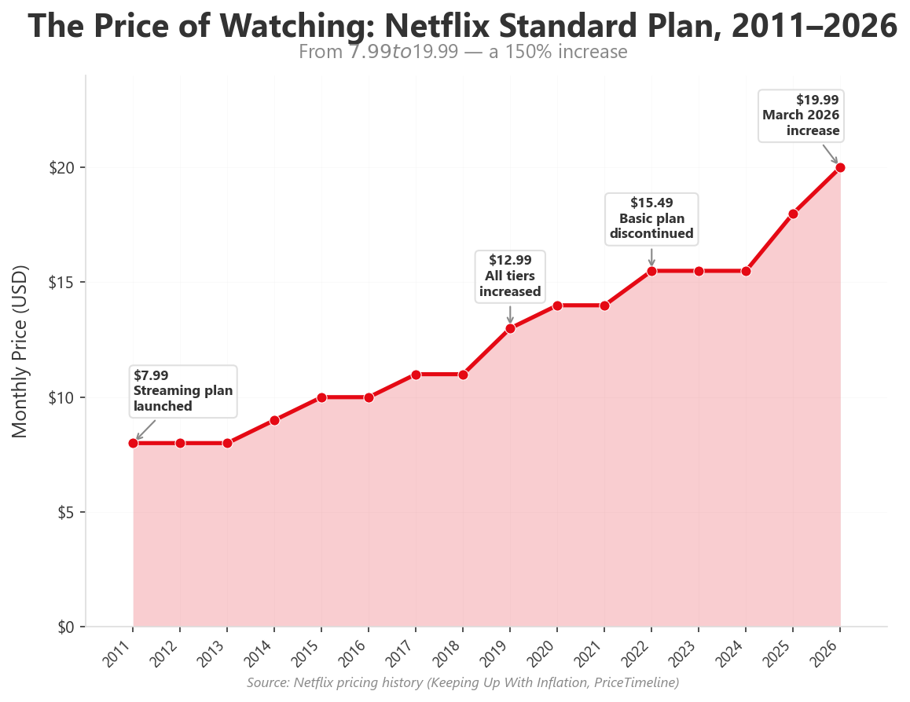
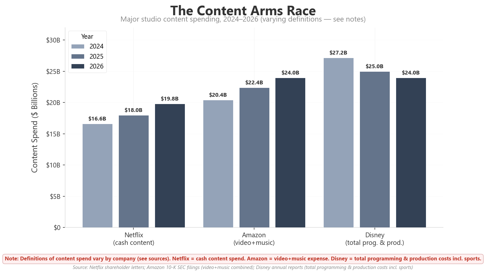
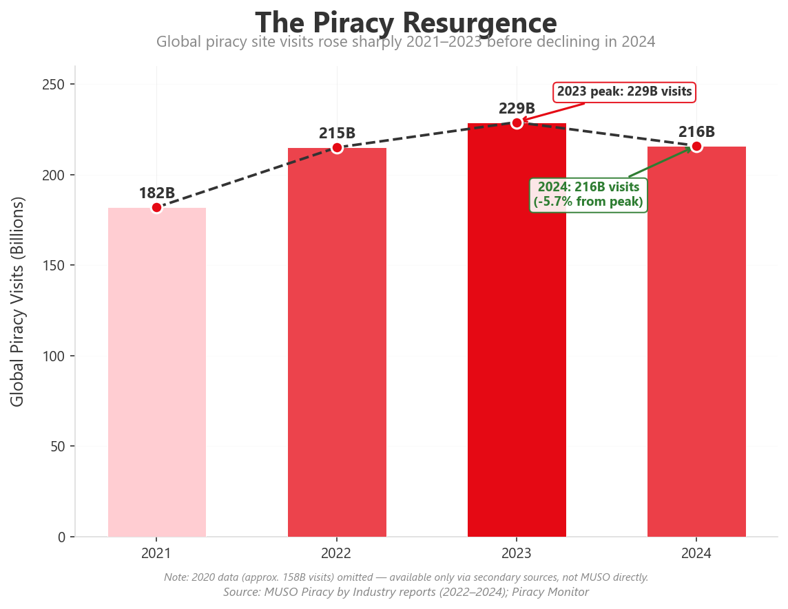
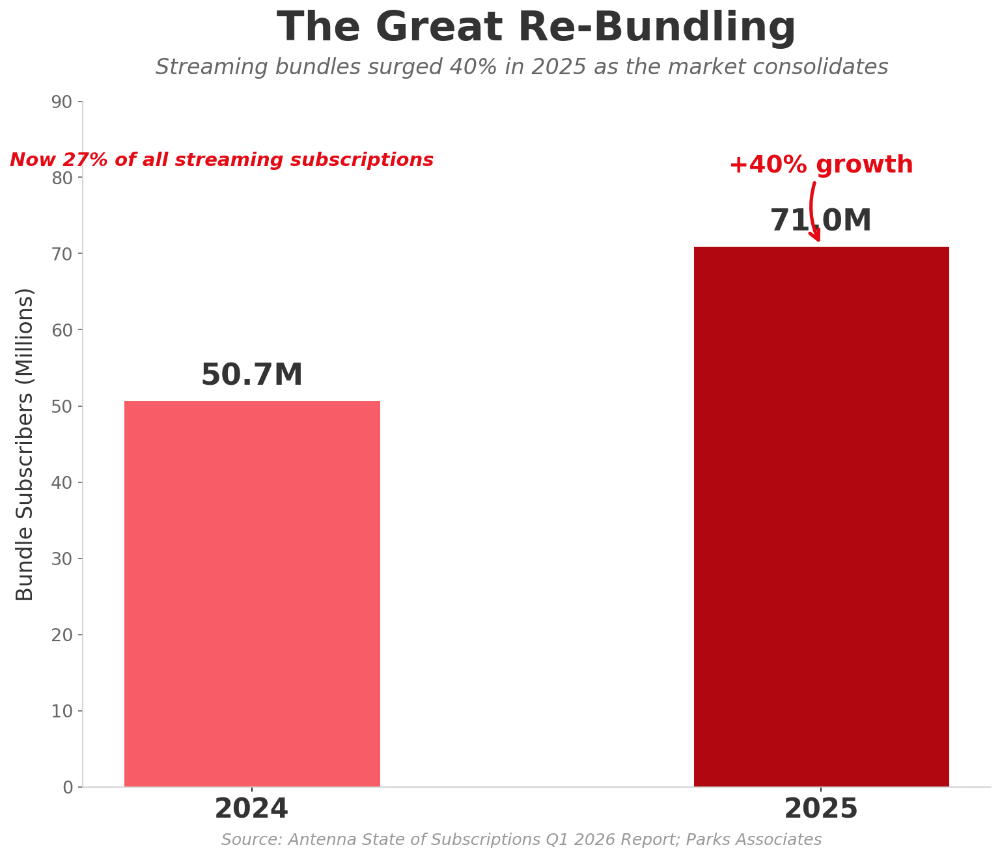
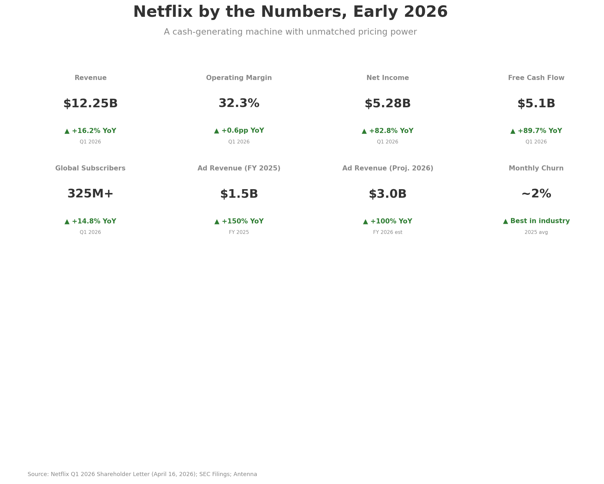

# The Netflix Paradox: Why We Keep Paying More for Less

**In the first quarter of 2026, Netflix reported $12.25 billion in revenue and told investors it expects to take in as much as $51.7 billion for the full year.** Operating margins hit 32.3 percent. Free cash flow — the real measure of financial health — reached $5.1 billion in three months. The company has 325 million global paid subscribers. By any conventional metric, Netflix is the most successful media business on the planet. [Netflix Q1 2026 Shareholder Letter](https://s22.q4cdn.com/959853165/files/doc_financials/2026/q1/FINAL-Q1-26-Shareholder-Letter.pdf)

**And yet, a majority of its own customers feel overcharged.** Deloitte's 2026 Digital Media Trends survey of 3,595 American consumers found that 47 percent believe they pay too much for streaming services; 41 percent say the content is not worth the price; and crucially, 60 percent would cancel their favorite SVOD service after a price increase of just $5. [Deloitte 2026 Digital Media Trends](https://www.deloitte.com/us/en/insights/industry/technology/digital-media-trends-consumption-habits-survey.html)

Here, then, is the paradox at the heart of the streaming age — and it is a paradox only if one expects rational behavior from a species that has never shown much aptitude for it. Netflix's Standard ad-free plan has risen from $7.99 a month in 2011 to $19.99 in March 2026 — a 150 percent increase. The Premium tier now costs $26.99. Even the ad-supported "budget" option is $8.99. [Keeping Up With Inflation Netflix Index](https://keepingupwithinflation.com/tracker/netflix/) Yet the company adds subscribers, generates record profits, and faces no serious existential threat from customer discontent. The question is not whether people are angry. It is why their anger has all the practical force of a staredown with the weather.

*The Standard Netflix plan has more than doubled since 2011, rising from $7.99 to $19.99 — a 150 percent increase. (Source: Netflix pricing history, PriceTimeline, Keeping Up With Inflation)*

## I. The Engine

To understand why Netflix keeps raising prices, you have to follow the money — and the money flows straight into content, that vast and hungry ocean where good intentions go to be amortized. The streaming industry will spend approximately $101 billion on programming in 2026, according to Ampere Analysis, representing roughly two-fifths of the total global content investment of $255 billion. [Ampere Analysis via Deadline](https://deadline.com/2026/01/streamer-spend-landmark-figure-2026-ampere-analysis-1236680312)

Netflix's own content budget was about $18 billion in 2025. The company plans to increase that by 10 percent in 2026. Amazon spent $22.4 billion on video and music content in 2025. Disney has committed $24 billion for fiscal 2026. [Netflix Q4 2025 Shareholder Letter via Financial Post](https://financialpost.com/investing/netflix-boost-program-spending-2026-crimping-profit) / [Amazon 10-K via Variety](https://variety.com/2026/tv/news/amazon-content-spending-2025-video-music-1236654302/)

This is not optional spending, and no one is pretending otherwise. In the streaming model, content is not a product — it is a moat. Netflix's balance sheet shows $32.8 billion in capitalized content assets (net of amortization) as of the end of 2025, split between $19.8 billion in owned/produced content and $13 billion in licensed content. [BusinessStats / Netflix 10-K 2025](https://businesstats.com/netflix-content-assets/) Content amortization — the largest single expense line in Netflix's income statement — runs at roughly $14–15 billion annually, with approximately 70–80 percent of a title's cost recognized in its first year of release, after which it begins the long, quiet death of being merely available.

The logic is brutal but internally consistent, like most things that are designed by accountants who have learned to think like poets. Netflix must produce enough programming to keep 325 million subscribers engaged. Engagement drives retention. Retention drives the low churn rate — approximately 2 percent monthly, the best in the industry, compared to the premium SVOD weighted average of 4.6 percent. [Antenna Q1 2026 State of Subscriptions](https://www.antenna.live/insights/antenna-q126-state-of-subscriptions-report-premium-svod-2025-year-in-review) And because content costs rise faster than inflation — talent salaries, production expenses, sports rights, and global licensing all escalate year over year — subscription prices must rise to maintain the 31.5 percent operating margin that Wall Street now expects, indeed demands, as though it were a moral right.

In Netflix's Q1 2026 earnings call, co-CEO Ted Sarandos put it plainly: "Looking ahead to '26 we're focused on improving the core business by increasing the variety and quality of our series and films." [CNBC / Netflix Q4 2025 Earnings](https://www.cnbc.com/2026/01/20/netflix-nflx-earnings-q4-2025.html) What goes unspoken is that "variety and quality" carry a price tag, and that price tag — like all bills in the modern economy — finds its way to the person least able to refuse it.

*Major studio content spending, 2024–2026. Note: definitions vary — Netflix = cash content spend; Amazon = video + music combined; Disney = total programming & production costs including sports rights and linear. (Source: Netflix shareholder letters, Amazon 10-K, Disney annual reports)*

## II. The Addiction

But if the economics explain the supply side, they do not explain the demand side, which is so much more interesting — because it is so much less rational. Why do people stay?

Part of the answer is structural. Netflix's churn rate of roughly 2 percent per month means that in any given month, 98 percent of subscribers do not cancel. That is extraordinary loyalty for a discretionary service — the kind of fidelity usually reserved for oxygen or disappointing relatives. The average US household now maintains 5.8 streaming subscriptions, according to Parks Associates, up from 5.5 in 2021. [Parks Associates via PRNewswire](https://www.prnewswire.com/news-releases/parks-associates-research-streaming-competition-and-profitability-pricing-models--retention-strategies-shows-cost-savings-not-content-is-the-primary-driver-of-streaming-churn-302683056.html)

But the deeper answer is behavioral. Netflix has engineered a product that exploits what behavioral economists call the "endowment effect" — the tendency to value what we already have more than what we could get. This is simply the formal name for the universal human preference for a comfortable prison over an uncertain freedom. The personalized recommendation engine, the algorithmic homepage, the Continue Watching row, the My List feature: these create a personalized content environment that is costly to abandon. Switching to another service means rebuilding your queue, retraining the algorithm, losing your place in half-watched series. The switching costs are not financial; they are cognitive. They are the small, grinding taxes we pay for having made a decision, any decision, and not wanting to admit we might have chosen badly.

There is also the question of perceived indispensability. Despite the proliferation of competitors — Disney+, Max, Prime Video, Apple TV+, Peacock, Paramount+, and dozens of niche services — Netflix remains the service most Americans say they would keep if forced to choose only one. It captures roughly 8 percent of total US TV viewing time, second only to YouTube in the streaming category. [eMarketer via Axis Intelligence](https://axis-intelligence.com/streaming-statistics-definitive-data-report/) It has, in other words, achieved what every brand dreams of: being the thing people complain about while refusing to leave.

And Netflix has proven remarkably adept at neutralizing the two weapons that could break its pricing power. The password-sharing crackdown, launched in 2023, converted tens of millions of freeloaders into paying subscribers — a move that added billions in revenue while provoking grumbles rather than revolt. (It is a truth rarely acknowledged, that a person in possession of a good password must be in want of a bill.) The ad-supported tier, introduced in late 2022, created a lower price point ($7.99, now $8.99) that functions as both a retention tool for price-sensitive customers and a new revenue stream. In 2025, Netflix's ad revenue grew by more than 2.5 times to over $1.5 billion; the company expects it to roughly double again to $3 billion in 2026. [Netflix Q4 2025 Shareholder Letter via CNBC](https://www.cnbc.com/2026/01/20/netflix-nflx-earnings-q4-2025.html)

The genius of the ad tier is that it transforms the pricing complaint into a choice — and a choice, once offered, becomes a personal failing rather than a corporate grievance. If $19.99 is too much, you can pay $8.99 and watch commercials. If $26.99 for Premium is excessive, you can downgrade. The customer is given an exit ramp that does not require leaving the platform entirely. It is the oldest trick in the book: offer people a lesser evil, and they will thank you for the mercy of staying.

## III. The Alternatives

The natural question, then, is whether the alternatives to streaming are actually viable. If Netflix is too expensive, what are the options? The answer, as with most things in modern life, is: a great many things that are somehow worse.

**Digital purchase and rental.** The transactional video-on-demand (TVOD) market — buying or renting individual movies and shows on platforms like Prime Video, Apple TV, and YouTube — generated about $3.8 billion in US consumer spending in 2025, according to the Digital Entertainment Group. That is down roughly 4 percent year over year. Digital purchases (EST) totaled $2.2 billion; rentals (VOD) $1.6 billion. [DEG 2025 Report via Media Play News](https://www.mediaplaynews.com/deg-ad-supported-subscription-streaming-revenue-soared-in-2025-with-digital-sales-and-rentals-resilient/)

The economics are revealing, and not in a kind light. A single digital movie purchase on Prime Video or Apple TV typically costs $14.99 to $24.99 for a new release. That is roughly the same as one month of Netflix's Standard plan — which buys access to thousands of titles. For heavy viewers, the arithmetic crushes the transactional model. For light viewers — those who watch one or two movies a month — it is more competitive, which is a polite way of saying that light viewers subsidize the heavy ones, as has always been the way of subscription businesses. About 44 percent of US households still interact with transactional platforms, though that figure has declined from 54 percent in early 2024. [Fabric Media via nScreenMedia](https://nscreenmedia.com/tvod-holds-on-against-svod-fast/)

**Physical media.** Here the story is more interesting — interesting in the way that a minor character unexpectedly upstages the lead. Sales of DVDs, Blu-rays, and 4K UHD discs have been declining for years — down more than 20 percent in 2023 and 2024. But in 2025, the decline slowed dramatically to just 9 percent, the smallest drop since 2010. And the premium 4K UHD format grew 12 percent year over year. [DEG 2025 Report] / [ERA via Film Stories](https://filmstories.co.uk/news/the-physical-media-landscape-in-2025-and-beyond/)

Physical media is having its vinyl moment — which is to say, it is enjoying the peculiar prestige of being the thing that everyone abandoned and that no one has yet managed to replace. Los Angeles video store Vidiots, which reopened in 2023, now rents more than 1,000 discs per week — up from a few hundred before it closed. In January 2026, it had its biggest month ever, averaging 170 rentals per day. [Marketplace](https://www.marketplace.org/episode/2026/02/26/physical-medias-comeback) The Criterion Collection reports "significant year-over-year increases" in sales. Barnes & Noble says its DVD and Blu-ray sales have risen by "mid-double digits" in the past year, driven disproportionately by young shoppers — who, having inherited nothing material from their parents, are now discovering the radical joy of owning a physical object that cannot be remotely deleted. [Los Angeles Times via KMB Communications](https://kmbcomm.com/the-return-of-physical-media/)

The drivers are practical rather than nostalgic, which is itself a refreshing change from most things that make a comeback. A Consumer Reports survey found that nearly half of Americans still watch DVDs and Blu-rays. The top reasons: ownership (streaming content can disappear when licenses expire — a practice so frustrating that California passed Assembly Bill 2426 in 2025 to prohibit digital storefronts from using "buy" unless the purchase is truly permanent), cost (a used DVD costs $3–5), and the sheer exhaustion of managing multiple subscriptions — that quiet, cumulative weariness that has come to define modern life. [Consumer Reports via Marketplace](https://www.marketplace.org/story/2026/02/17/dvds-and-blu-ray-discs-and-vhs-tapes-are-cool-again)

Alliance Entertainment, one of the largest physical media distributors, reported in May 2026 that its movie disc sales rose 5 percent year over year — a small number, but a symbolic reversal after years of decline. [Alliance Entertainment Q3 Earnings via Media Play News](https://www.mediaplaynews.com/alliance-entertainment-ups-quarterly-profit-revenue-with-movie-disc-sales-up-5/)

Still, the scale gap is cavernous. Physical media generates roughly $1 billion in annual US revenue. Streaming (SVOD alone) generates $47.2 billion. Physical media is not coming back as an economic force. It is coming back as a cultural signal — a small but meaningful rebellion against the rental economy in which nothing is yours, not even the movie you just paid to watch. [DEG 2025 Report]

**Piracy.** And then there is the alternative the industry would prefer we not discuss — the uninvited guest at the table, eating with its hands and having a perfectly lovely time. Global visits to piracy websites totaled 216 billion in 2024, according to MUSO, an anti-piracy analytics firm. That was down 5.7 percent from 2023, but still more than double the approximately 104 billion visits recorded in 2020. TV piracy alone accounted for 96.8 billion visits. [MUSO 2024 Piracy Trends Report](https://www.muso.com/hubfs/MUSO%202024%20Piracy%20Trends%20and%20Insights.pdf)

Industry analysts have explicitly linked the piracy resurgence to streaming price increases and content fragmentation. This should surprise exactly no one. A single pirate aggregator offers one search bar, one interface, and no subscription fees — the unified experience that streaming has fragmented across a dozen paywalls, each demanding its own monthly tribute. As one 2026 industry survey noted, the biggest attraction of pirate services is "the convenience of finding all of the content you want in one place" (73 percent of respondents). [decodeTV 2026 Industry Survey via Piracy Monitor](https://piracymonitor.org/2026-industry-survey-operators-split-on-value-of-anti-piracy-consumers-dismissive-of-threats/) What the industry calls piracy, the consumer calls a better user experience.

*Global piracy site visits rose sharply from 182 billion in 2021 to a peak of 229 billion in 2023, before declining to 216 billion in 2024. (Source: MUSO Piracy by Industry reports; Piracy Monitor)*

## IV. The Future: Re-bundling

If the current trajectory is unsustainable — content costs rising, subscription growth slowing to single digits, churn stabilizing at elevated levels — where does it end? The answer, as with so many things in the modern economy, is that it ends exactly where it began, but more expensive.

The dominant answer from every major industry forecast is **consolidation and re-bundling**. PwC's 2024–2028 Global Entertainment & Media Outlook explicitly describes "the end of the standalone streaming era." AlixPartners' 2026 Media & Entertainment Predictions forecasts "increased cooperation and consolidation between streamers and broadcasters," with dozens of new deals as platforms team up, exchange content, and embrace their competition as "frenemies" — a term that sounds charming until you realize it describes the economic equivalent of a marriage of convenience entered into by people who have already exhausted every other option. [PwC Outlook](https://www.pwc.at/en/issues/entertainment-media-2024.html) / [AlixPartners 2026 Predictions](https://www.alixpartners.com/media/x04lwcgr/2026-media-and-entertainment-predictions-report-tmt01sig2025.pdf)

Looper Insights surveyed 61 senior streaming executives and found that 76.5 percent expect mounting pressure to improve profitability will force mid-tier streamers to sell or merge as growth stalls. "Streaming consolidation is likely to mean fewer shows overall, with budgets and attention concentrated on bigger, safer bets," said Michael Goodman, Director of Entertainment Research at Parks Associates — confirming, in polished consultant-speak, that the age of adventurous programming is giving way to the age of actuarial tables. [Looper Insights](https://looperinsights.com/resources/reports-resources/the-big-reset-10-trends-reshaping-streaming-in-2026/)

The result will be a market that looks increasingly like cable television — but owned by tech companies, which is rather like buying a horse from someone who has only ever designed a car. Already, bundles are proliferating: Disney+ and Hulu and Max are sold together; Comcast's StreamSaver bundles Peacock, Netflix, and Apple TV+; Sky in the UK recently launched a package combining Disney+, Netflix, Hayu, and HBO Max for £24 a month. Antenna reports that bundle subscribers grew 40 percent in 2025, now accounting for 27 percent of all streaming subscriptions. [Antenna Q1 2026 Report] / [Streaming Media Global](https://www.streamingmediaglobal.com/Articles/Editorial/Featured-Articles/The-State-of-Media--Entertainment-Streaming-2026-173873.aspx)

Advertising will play an increasingly central role. The global AVOD market is projected to reach $69 billion by 2027, up from $38 billion in 2023. [Statista via Axis Intelligence](https://axis-intelligence.com/streaming-statistics-definitive-data-report/) By 2028, advertising will account for about 28 percent of global streaming revenues, up from 20 percent in 2023, according to PwC. The ad-supported tier, far from being a discount option, is becoming the primary product — which is to say, the industry has discovered that selling audiences to advertisers is more profitable than selling entertainment to audiences, a revelation that would have surprised nobody who lived through the twentieth century.

Netflix itself is at the center of this transformation. Its attempted $27.75-per-share acquisition of Warner Bros. Discovery's studio and streaming assets — a deal currently under antitrust review by the US Department of Justice — would give it one of the richest film and TV libraries in the world, along with HBO, CNN, and a vast production infrastructure. If completed, it would create a media conglomerate that rivals the old studio system, which is to say it would succeed by acquiring what it could not build and dominating what it could not join. [Netflix SEC 8-K, Jan 20 2026](https://www.sec.gov/Archives/edgar/data/1065280/000106528026000033/nflx-20260120.htm)

*After years of fragmentation, streaming is re-bundling. Bundle subscribers grew 40% in 2025 and now represent 27% of all streaming subscriptions. (Source: Antenna State of Subscriptions Q1 2026; Parks Associates)*

## V. The Question Nobody Wants to Answer

The streaming paradox is not actually a paradox. It is a reflection of a market that has found its equilibrium — a small number of very large platforms extracting rising rents from a customer base that has nowhere better to go, and the good sense not to pretend otherwise.

The alternatives — digital purchase, physical media, piracy — are real but structurally marginal. Digital purchases cost more per title than a subscription. Physical media is experiencing a cultural renaissance, but the economics are trivial compared to streaming. Piracy is growing, but it remains a fringe activity for most consumers, and the industry has proven adept at enforcement when it chooses to be.

What the data actually shows is that consumers are not abandoning streaming. They are optimizing it — which is another way of saying they are learning to live with something they increasingly resent. They are subscribing to fewer services simultaneously. They are rotating — signing up for a month to binge a specific show, canceling, moving to another service, returning later. They are accepting ads in exchange for lower prices. They are monitoring their spending more carefully. But they are not leaving the ecosystem. They have made their peace with the machine, and the machine has made its peace with their resentment.

The 4.6 percent monthly churn rate that Antenna documents is not a sign of instability. It is the market's way of saying that most people, most of the time, are willing to pay — and that the ones who leave will be replaced by new subscribers who have not yet had their fill of disappointment. The 60 percent who say they would cancel after a $5 price increase have not actually been tested — because the price increases come in $1 or $2 increments, spread over years, absorbed gradually into household budgets like the slow creep of inflation itself, or the slow erosion of any standard one once thought firm.

Netflix's co-founder Reed Hastings, who is set to retire in 2026, once said the company's biggest competitor was sleep. He was half-joking, but the insight was real. Streaming has embedded itself into the fabric of daily life more deeply than any entertainment medium since television itself — that other great monopolist of attention, now quaintly recalled as having been free. Breaking that habit is harder than any price increase, harder even than the accumulated petty irritations of a thousand smaller compromises.

The real question — the one that investors, analysts, and consumers all circle but never quite answer — is whether there is any price at which the habit breaks. The data so far suggests: not yet. But the margin for error is shrinking. Every price increase adds a few more rotators, a few more pirates, a few more people rediscovering the pleasure of a shelf full of Blu-rays — that small, tactile rebellion against a world in which nothing is permanent and everything costs a monthly fee. The streaming industry has built a magnificent machine. The question is how hard it can run before the parts start to wear, and whether, in the end, we will notice the difference between a machine that has broken and a machine we have simply stopped caring about.

*Netflix's financial profile in early 2026: a cash-generating machine with pricing power that most media companies can only dream of. (Source: Netflix Q1 2026 Shareholder Letter, SEC Filings, Antenna)*

---

## Source Notes

This article draws on the following primary and authoritative sources:

1. **Netflix Q1 2026 Shareholder Letter** (April 16, 2026) — Direct source for Q1 2026 revenue, operating margin, FCF, ad revenue projections, and management commentary. [SEC Filing via Last10K](https://last10k.com/sec-filings/nflx/0001065280-26-000138.htm)
2. **Netflix SEC 8-K, Q4 2025 Results** (January 20, 2026) — Official filing confirming 325M subscribers, revenue of $12.05B in Q4 2025, full-year 2025 revenue of $45.2B. [SEC EDGAR](https://www.sec.gov/Archives/edgar/data/1065280/000106528026000033/nflx-20260120.htm)
3. **Deloitte 2026 Digital Media Trends Survey** — Survey of 3,595 US consumers on streaming attitudes, pricing tolerance, churn behavior. [Deloitte Insights](https://www.deloitte.com/us/en/insights/industry/technology/digital-media-trends-consumption-habits-survey.html)
4. **Antenna State of Subscriptions Q1 2026 Report** — Premium SVOD churn rates, subscriber growth data, bundling statistics. [Antenna](https://www.antenna.live/insights/antenna-q126-state-of-subscriptions-report-premium-svod-2025-year-in-review)
5. **Ampere Analysis** — Global content spend forecast ($101B streamer spend in 2026). Reported by [Deadline](https://deadline.com/2026/01/streamer-spend-landmark-figure-2026-ampere-analysis-1236680312) and [The Streamable](https://thestreamable.com/global-streaming-content-spend-2026-ampere-analysis)
6. **DEG: The Digital Entertainment Group** — 2025 US home entertainment revenue data ($62.2B total, streaming 92.4%, physical 1.4%, digital transactions ~$3.8B). Reported by [Media Play News](https://www.mediaplaynews.com/deg-ad-supported-subscription-streaming-revenue-soared-in-2025-with-digital-sales-and-rentals-resilient/)
7. **MUSO 2024 Piracy Trends Report** — Global piracy visit data (216B visits in 2024). [MUSO PDF](https://www.muso.com/hubfs/MUSO%202024%20Piracy%20Trends%20and%20Insights.pdf)
8. **Parks Associates** — SVOD household subscription counts (5.8 avg), churn driver data. [PRNewswire](https://www.prnewswire.com/news-releases/parks-associates-research-streaming-competition-and-profitability-pricing-models--retention-strategies-shows-cost-savings-not-content-is-the-primary-driver-of-streaming-churn-302683056.html)
9. **Consumer Reports / Marketplace** — Physical media survey data (nearly half of Americans still use DVDs/Blu-rays). [Marketplace](https://www.marketplace.org/episode/2026/02/26/physical-medias-comeback)
10. **Alliance Entertainment Q3 2026 Earnings** — Physical disc sales up 5% YoY. [Media Play News](https://www.mediaplaynews.com/alliance-entertainment-ups-quarterly-profit-revenue-with-movie-disc-sales-up-5/)
11. **PwC Global Entertainment & Media Outlook 2024–2028** — Streaming revenue projections, AVOD growth forecasts, consolidation thesis. [PwC](https://www.pwc.at/en/issues/entertainment-media-2024.html)
12. **AlixPartners 2026 Media & Entertainment Predictions** — Industry consolidation forecasts, "frenemy" dynamics. [AlixPartners PDF](https://www.alixpartners.com/media/x04lwcgr/2026-media-and-entertainment-predictions-report-tmt01sig2025.pdf)
13. **Looper Insights** — Executive survey on streaming consolidation expectations (76.5% expect mid-tier M&A). [Looper Insights](https://looperinsights.com/resources/reports-resources/the-big-reset-10-trends-reshaping-streaming-in-2026/)
14. **Netflix Content Asset Data** — $32.8B capitalized content assets, split produced/licensed. [BusinessStats](https://businesstats.com/netflix-content-assets/)
15. **Pricing History** — [Keeping Up With Inflation](https://keepingupwithinflation.com/tracker/netflix/), [PriceTimeline](https://pricetimeline.com/data/streaming/netflix-price-history.php), [Dexerto](https://www.dexerto.com/tv-movies/netflix-price-hike-timeline-3038310/)
