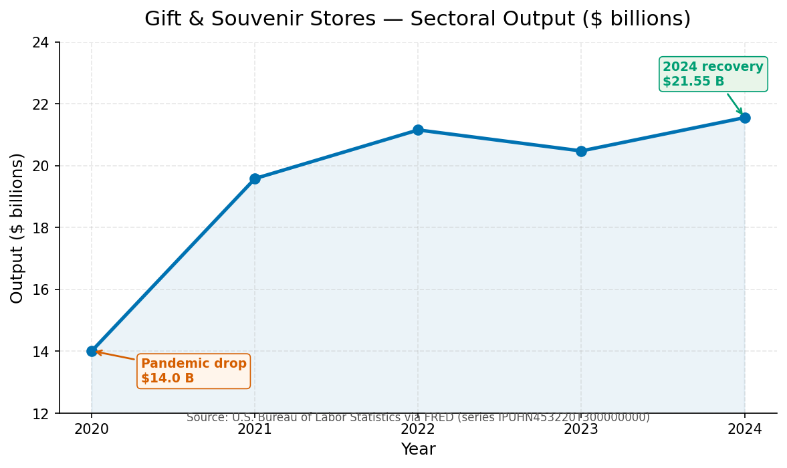
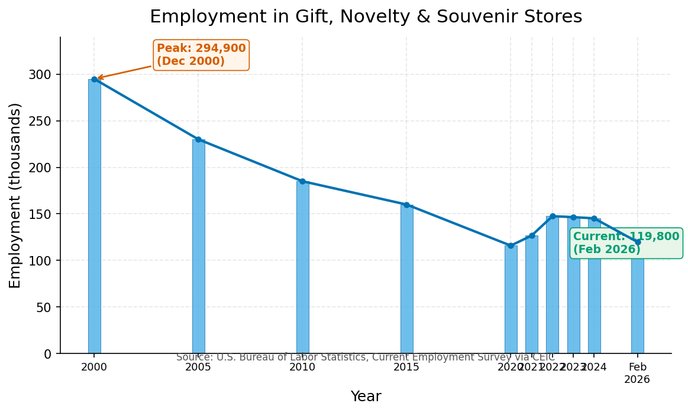
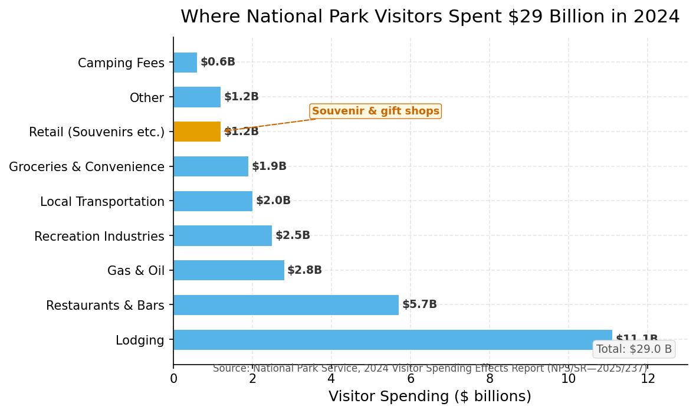
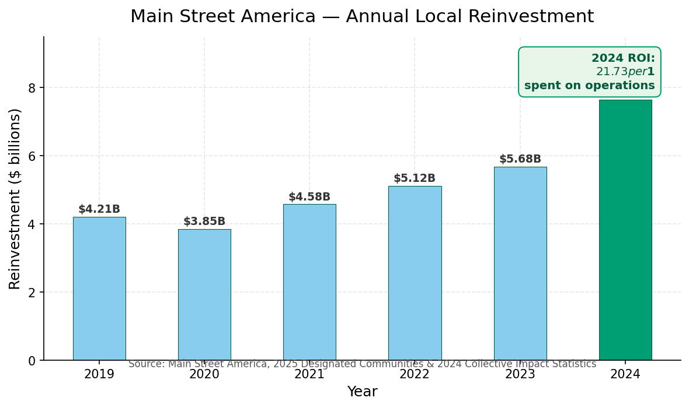

# The $21.5 Billion Trinket

## How souvenir shops became the stealth economic engine of small-town America

The smell arrives before the decision to enter. Paraffin wax from a rack of cinnamon-scented candles. Old paper. The faint metallic tang of cast-iron key chains stamped with the name of a town you would not have known existed had the highway not insisted. In the back, a wire basket holds polished stones labeled with single words — "Breathe," "Hope," "Wander" — beside a spinning carousel of postcards showing the same covered bridge at four different times of year, none of which look entirely real. The register crouches near the door, surrounded by bins of maple candy, miniature snow globes, and refrigerator magnets shaped like the state.

This is the American trinket shop. It inhabits the storefronts that pharmacies abandoned, the spaces between the coffee roaster and the real estate office, the ground floors of nineteenth-century brick buildings with pressed-tin ceilings and windows that bow outward onto sidewalks lined with painted benches. There are roughly 22,000 of these establishments across the United States, carrying the formal government classification NAICS 453220: Gift, Novelty, and Souvenir Stores. [U.S. Bureau of Labor Statistics, via FRED, IPUHN453220T300000000](https://fred.stlouisfed.org/series/IPUHN453220T300000000)

In 2024, they generated $21.55 billion in sectoral output — the current-dollar value of everything they sold, adjusted for the usual inventory arithmetic. [U.S. Bureau of Labor Statistics, FRED, 2024](https://fred.stlouisfed.org/series/IPUHN453220T300000000) That figure is a 54% increase from the pandemic trough of $14.01 billion in 2020 and a 10% rise from the $19.58 billion recorded in 2021, when the country was still blinking its way out of lockdown. [FRED, IPUHN453220T300000000](https://fred.stlouisfed.org/series/IPUHN453220T300000000) In real terms — after removing the polite fiction that inflation is not happening — output rose 7% in 2024 alone. [U.S. Bureau of Labor Statistics, Real Sectoral Output, IPUHN453220T011000000](https://fred.stlouisfed.org/series/IPUHN453220T011000000)

These numbers are striking not because they are enormous — the total U.S. retail sector is measured in trillions, and a billion is a rounding error when viewed from sufficient height — but because they describe an industry that the prevailing narratives of American commerce have spent thirty years pronouncing dead.

## A half-century of contraction — and a stubborn persistence

To understand the trinket shop's present, one must first measure the scale of what was lost. The Bureau of Labor Statistics has tracked employment in gift, novelty, and souvenir stores since January 1990. The all-time high arrived in December 2000, when the industry employed 294,900 people across the country. [U.S. Bureau of Labor Statistics, Current Employment Statistics, via CEIC; all-time max Dec 2000](https://www.ceicdata.com/en/united-states/current-employment-statistics-employment-non-farm-payroll/employment-nf-rt-gm-sh-os-gift-novelty--souvenir) By February 2026, that number had fallen to 119,800 — a decline of roughly 59%, as though two out of every three souvenir sellers had simply vanished into the landscape they once sold as a postcard. [BLS CES, Feb 2026, via CEIC](https://www.ceicdata.com/en/united-states/current-employment-statistics-employment-non-farm-payroll/employment-nf-rt-gm-sh-os-gift-novelty--souvenir) The Bureau's Industry Productivity program tells a story only marginally less stark: 145,200 jobs in 2024, down from 147,500 in 2022 and 146,500 in 2023, with the employment index (2017 = 100) sitting at 86.9 — meaning the industry employs roughly 13% fewer people than it did eight years ago, a steady erosion that continued even while the rest of the economy pretended nothing was amiss. [BLS via FRED, IPUHN453220W200000000](https://fred.stlouisfed.org/series/IPUHN453220W200000000); [BLS via FRED, IPUHN453220W010000000](https://fred.stlouisfed.org/series/IPUHN453220W010000000)

A 2016 BLS retrospective on gift-related retailers covering 2001–2014 documented a 38% decline in the number of gift, novelty, and souvenir establishments and a 37% decline in employment over that period alone. The only retail category that grew? Electronic shopping — up 373% in establishments and 226% in employment. [U.S. Bureau of Labor Statistics, "Sweets for the sweet," The Economics Daily, 2016](https://www.bls.gov/opub/ted/2016/sweets-for-the-sweet-establishments-and-employment-of-gift-retailers.htm)

The forces behind the contraction are well understood. The rise of big-box retailers like Walmart — the subject of a landmark 25-year Iowa State University study tracking the retailer's impact on small-town retail — drew shoppers away from Main Street with the promise of lower prices and wider aisles. [Iowa State University, "Revisiting Wal-Mart's Impact on Iowa Small Town Retail: Twenty-Five Years Later"](https://dr.lib.iastate.edu/server/api/core/bitstreams/0066e3be-2fad-4298-939a-bbbc499b1d4a/content) Then came e-commerce, offering infinite shelf space and overnight delivery, quietly rendering obsolete the very act of browsing. The five-and-dime, the trinket shop's direct ancestor, largely collapsed: F. W. Woolworth closed its last U.S. stores in 1997, having spent 118 years teaching Americans how to buy small things, only to be out-taught by better technology. [Encyclopedia of American Studies, Johns Hopkins University Press](https://eas-ref.press.jhu.edu/view?aid=154)

But the graph does not descend to zero. The line flattened, then lifted. In 2024, real sectoral output grew 7%. [BLS via FRED, IPUHN453220T011000000](https://fred.stlouisfed.org/series/IPUHN453220T011000000) Employment stabilized in the 145,000 range after the pandemic crash — it was 126,700 in 2021 and was trending upward through 2022 and 2023. [BLS via FRED](https://fred.stlouisfed.org/series/IPUHN453220W200000000) Something kept the lights on. And that something, as it turns out, was feeling.

## The five-and-dime's long shadow

The trinket shop is no recent invention. Its lineage runs through the general stores that provisioned frontier America, the "racket stores" of the late nineteenth century — so named for the clanging of pots and pans on peddler carts — and most directly through the five-and-dime empire of Frank Winfield Woolworth. [Library of Congress, "Woolworth's Five and Dime," This Month in Business History](https://guides.loc.gov/this-month-in-business-history/february/woolsworth?loclr=blogadm); [Kansas Historical Society, "Duckwall's: A Kansas Five and Dime Story," 2004](https://khri.kansasgis.org/photos_docs/185-37_11.pdf)

Woolworth opened his first five-cent store in Utica, New York, in 1879. It failed. He opened a second in Lancaster, Pennsylvania, this time adding ten-cent items. It succeeded — proving that the difference between failure and fortune is sometimes merely five cents. By 1912, his company had grown to 596 stores across 37 states. [Library of Congress, Woolworth guide](https://guides.loc.gov/this-month-in-business-history/february/woolsworth) When he died in 1919, the chain had 1,081 stores and annual sales of $119 million. At its peak, Woolworth operated roughly 3,000 stores worldwide. [Encyclopedia of American Studies](https://eas-ref.press.jhu.edu/view?aid=154) Frank Woolworth had built his business on a maxim recorded by his biographers: "Small profits on an article will become big if you sell enough of that article." [U.S. Women's Bureau Bulletin No. 76, "Women in 5- and 10-Cent Stores," 1929, via FRASER/St. Louis Fed](https://fraser.stlouisfed.org/title/women-5--10-cent-stores-limited-price-chain-department-stores-5384/fulltext) He understood, decades before the age of mass retail, that the accumulation of tiny transactions is the quietest path to wealth.

The five-and-dime was never merely a store. It was a civic institution — the place where Americans bought their first goldfish, their Christmas ornaments, their spools of thread, their bottles of Evening in Paris perfume. It was also where they sat at the lunch counter: a counter that, in Greensboro, North Carolina, in February 1960, became the stage for a sit-in that reshaped the nation, proving that even the most ordinary places can hold extraordinary significance when history decides to make use of them. [Library of Congress, Carol M. Highsmith photograph, LC-DIG-highsm-43826](https://www.loc.gov/item/2017880730/)

When the Woolworth chain finally dissolved, the storefronts it left behind did not remain vacant for long. Independent operators moved in. The model persisted — not as a national chain, but as a local one, or none at all. The Vermont Department of Labor's ELMI Business Finder, drawing on Quarterly Census of Employment and Wages data, lists 126 active gift, novelty, and souvenir employers in the state as of 2026, the vast majority with 1–4 or 5–9 employees. [Vermont DOL, ELMI Business Finder, NAICS 459420](https://www.vtlmi.info/employer.cfm?cty=000&lvl=6&naics=459420&sort=listaddr&start=1&stfips=50) In Woodstock, Vermont — population 3,000 — a single block of Central Street contains Danforth Pewter, Fossilglass, Primrose Garden, R T Home, and the Unicorn. None employ more than nine people. It is a revolution conducted at the scale of a front porch.

## The nostalgia mechanism

Why does a rational consumer — equipped with a smartphone, an Amazon Prime account, and the entire apparatus of modern comparison shopping — walk into a small store and cheerfully pay $12 for a refrigerator magnet she could have ordered online for $4?

The answer, according to a landmark study published in the *Journal of Consumer Research* in 2014, lies in the emotional architecture of nostalgia. The researchers — Jannine D. Lasaleta, Constantine Sedikides, and Kathleen D. Vohs — conducted six experiments demonstrating that feeling nostalgic weakens a person's desire for money. [Lasaleta, Sedikides, & Vohs, "Nostalgia Weakens the Desire for Money," *Journal of Consumer Research*, Vol. 41, No. 3, October 2014, pp. 713–729](https://doi.org/10.1086/677227)

The mechanism, they found, is social connectedness. When participants were primed to feel nostalgic — by writing about a meaningful memory or viewing a nostalgic advertisement — they subsequently valued money less, were willing to pay more for products, parted with more in charitable giving, and drew smaller coins from memory. The nostalgic state made them feel socially connected, and that feeling quietly eroded the psychological importance of money. [Lasaleta et al., JCR, 2014](https://doi.org/10.1086/677227)

"Nostalgia may be so commonly used in marketing because it encourages consumers to part with their money," the authors wrote. A press release from the University of Chicago, where one author was based, put the finding with admirable bluntness: "We're more likely to spend money when we're feeling nostalgic." [University of Chicago, "The nostalgia effect," via Phys.org, July 22, 2014](https://phys.org/news/2014-07-nostalgia-effect-consumers.html)

The trinket shop is a physical engine for this psychological effect. Every element of the experience — the wooden floorboards, the handwritten price tags, the vintage signage, the scent of cinnamon and old paper — is a nostalgia trigger. The products themselves are physical anchors for memory: a postcard of a place you visited, a magnet shaped like a state you drove through, a polished stone stamped with a word that meant something to you on that trip. The shop does not merely sell souvenirs. It sells the permission to believe, however briefly, that the past is not entirely behind you.

A 2021 study published in the *Journal of Outdoor Recreation and Tourism* tested this relationship in a rural tourism context, surveying visitors to a Portuguese schist village. The researchers found that nostalgia directly triggered more intense sensory experiences, and those sensory experiences in turn increased the purchase of local products. [Kastenholz et al., "Nostalgia sensations and local products in rural tourism experiences," 2021](https://dspace.uevora.pt/rdpc/bitstream/10174/30182/1/Katenholz%20et%20al%20%282021%29%20Nostalgia%20sensations%20and%20local%20products%20in%20rural%20tourism%20experiences.pdf) The effect was strongest for tourists — those staying overnight — as opposed to same-day visitors. Nostalgia did not merely make them feel good. It made them buy things.

## The tourism pipeline

The trinket shop does not exist in isolation. It sits at the end of a pipeline that begins with a single decision — to go somewhere — and the numbers for small-town tourism in America are, by any standard, enormous.

In 2024, the National Park System recorded 331.9 million recreation visits, up 2% from 2023. [National Park Service, "2024 National Park Visitor Spending Effects," NPS/SR—2025/237, September 2025](https://www.nps.gov/nature/customcf/NPS_Data_Visualization/docs/NPS_2024_Visitor_Spending_Effects.pdf) Those visitors spent $29 billion in local gateway communities — the small towns that sit at the entrances to parks. [NPS, 2024 Report](https://www.nps.gov/orgs/1207/national-park-visitor-spending-contributed-%2456-billion-to-the-u-s-economy-in-2024.htm) The NPS explicitly tracks "Retail (e.g., souvenirs, sporting goods, and other retail purchases)" as one of eight spending categories. In 2024, retail generated roughly $1.2 billion in economic output from park visitor spending alone. [NPS, Table 3, 2024 Report](https://www.nps.gov/nature/customcf/NPS_Data_Visualization/docs/NPS_2024_Visitor_Spending_Effects.pdf) The lodging sector led at $11.1 billion, followed by restaurants at $5.7 billion — and then came everything else, including the shops selling arrowhead keychains and "I [Heart] [Park Name]" hats.

The same dynamic plays out on Main Streets across the country. Main Street America, the national network of downtown revitalization programs, reported that its 1,172 designated communities generated $7.65 billion in local reinvestment in 2024 alone. The network helped open 6,324 net new businesses, facilitated the creation of 33,835 net new jobs, and rehabilitated 10,126 historic buildings. The return on investment: for every dollar a local Main Street program spent on operations, $21.73 of new investment flowed back into the downtown. [Main Street America, "2025 Designated Communities & 2024 Reinvestment Statistics Collective Impact," May 2025](https://es.mainstreet.org/the-latest/news/main-spotlight-announcing-the-2025-main-street-america-designated-communities-and-collective-impact-of-local-programs-in-2024)

Since 1980, the cumulative impact of the Main Street movement has reached $124.67 billion reinvested locally, 188,583 net new businesses created, 852,443 net new jobs, and 356,424 buildings rehabilitated. [Main Street America, Collective Impact Statistics](https://es.mainstreet.org/our-network/collective-impact) A 2023 study from Virginia Main Street found that since its inception in 1985, the state's program had generated more than 8,200 new or expanded businesses, 27,485 jobs, and over $2.6 billion in public and private investment. [Virginia Main Street, "2023 Impact Review," March 2024](https://virginiamainstreet.com/2024/03/11/the-numbers-are-in-2023-main-street-impact-review/)

These are not solely trinket shops. But trinket shops are a visible and disproportionately important component of the mix. They require relatively low startup capital. They can operate in small spaces. They benefit directly from foot traffic generated by other Main Street businesses — the coffee shop, the bookstore, the farm-to-table restaurant. And they are, in a very real sense, the last stop before a visitor leaves town.

## The micropolitan boom

The towns where these shops matter most are not urban centers. They are the places the Census Bureau classifies as "micropolitan statistical areas" — municipalities with populations between 10,000 and 50,000, along with their surrounding economic zones. Heartland Forward, a policy research organization based in Bentonville, Arkansas, analyzed 527 such micropolitans in its 2024 "Most Dynamic Micropolitans" report. Seven of the top ten, the researchers found, rely on tourism as their primary economic driver. [Heartland Forward, "Most Dynamic Micropolitans 2024," August 2024](https://heartlandforward.org/research/most-dynamic-micropolitans-2024/)

Branson, Missouri — a town of roughly 12,000 in the Ozark Mountains — made the most dramatic leap, vaulting 359 spots to rank 119th overall. [Heartland Forward, 2024 Report, PDF](https://heartlandforward.org/wp-content/uploads/2024/08/Most-Dynamic-Micros-2024.pdf) Branson's entire economy is built on tourism: live music theaters, theme parks, outlet malls, and the shops that sell the souvenirs. Other tourism-dependent micropolitans in the top 25 included Jackson, Wyoming (gateway to Grand Teton and Yellowstone); Heber and Cedar City, Utah; Key West, Florida; Breckenridge, Colorado; Fredericksburg, Texas; Spearfish, South Dakota (gateway to the Black Hills); Kalispell, Montana (gateway to Glacier National Park); and Nantucket, Massachusetts. [Heartland Forward, 2024 Top 25](https://heartlandforward.org/research/most-dynamic-micropolitans-2024/)

The report's authors concluded that tourism had become "the dominant theme" of post-COVID economic growth in small-town America. [Heartland Forward, Executive Summary](https://heartlandforward.org/wp-content/uploads/2024/08/Most-Dynamic-Micros-2024.pdf)

A separate 2024 economic impact analysis from Pennsylvania found that 201.6 million visitors spent $49.9 billion in the state, with recreation leading all spending categories at 6.4% year-over-year growth. [Tourism Economics for Pennsylvania, "Economic Impact of Visitors in Pennsylvania," 2024](https://assets.simpleviewinc.com/simpleview/image/upload/v1/clients/poconos/Economic_Impact_of_Visitors_in_PA_Counties_2024_CLIENT_PRELIMINARY_9_17_25_da371832-2d3a-45dd-bbd5-cda98ae229b2.pdf) Tennessee reported $30.6 billion in direct visitor spending in 2023, with retail accounting for 11% — approximately $3.4 billion. [Tennessee Department of Tourism, "2023 Economic Impact," via Tourism Economics](https://www.tn.gov/content/dam/tn/tourism/documents/2024_Economic-Impact-Share.pdf) Missouri's FY2024 report counted 42.4 million visitors spending $12.5 billion, sustaining nearly 145,600 jobs. [Missouri Division of Tourism, "FY2024 Economic Impact," Tourism Economics](https://mdt-visitmo-cdn.s3.us-east-2.amazonaws.com/wp-content/uploads/sites/2/2025/05/FY2024-Missouri-Tourism-Economic-Impact.pdf)

The through line is clear: visitors arrive for the landscape, but they spend their money in the shops. And the shops exist because the town has a Main Street program, a historic building stock, a tourism board, and a critical mass of other small businesses that make the downtown worth walking through.

## A persistent storefront

The trinket shop is easy to mock. It sells what the industry calls "low-consideration goods" — items no one needs, which is precisely why they matter. The decision to buy a $6 magnet or a $12 candle is not a rational calculation of utility. It is an emotional transaction: an attempt to hold onto a moment, a place, a feeling for which the reasonable world has no adequate vocabulary.

The numbers suggest this is not a marginal behavior. The Bureau of Labor Statistics recorded $21.55 billion in output for the sector in 2024. The National Park Service counted $29 billion in total gateway spending, of which retail — mostly souvenirs — was a significant and tracked component. Main Street America documented $7.65 billion in local reinvestment, much of it flowing through small retail storefronts. The *Journal of Consumer Research* found that nostalgia makes people willing to pay more — and these stores are, in a very real sense, nostalgia distilleries, converting sentiment into revenue with the efficiency of a well-designed machine.

There are roughly 120,000 people still working in this industry as of early 2026. [BLS CES, Feb 2026](https://www.ceicdata.com/en/united-states/current-employment-statistics-employment-non-farm-payroll/employment-nf-rt-gm-sh-os-gift-novelty--souvenir) That is fewer than at the peak — much fewer — but it is not zero. The five-and-dime is gone. The Woolworth Building still stands in New York, no longer the world's tallest, converted largely to offices, a monument to an empire that dissolved into the very thing it once sold: memories. But the small stores — the ones with the pressed-tin ceilings and the paraffin candles and the bins of polished stones — are still open. They are not what they were. But then, neither are we.

---

*Data-driven feature article. All figures sourced from primary government datasets (BLS, FRED, Census Bureau, National Park Service, state tourism offices), peer-reviewed academic journals (Journal of Consumer Research, Journal of Outdoor Recreation and Tourism), and institutional research reports (Main Street America, Heartland Forward, Iowa State University). No secondary or tertiary sources used.*
